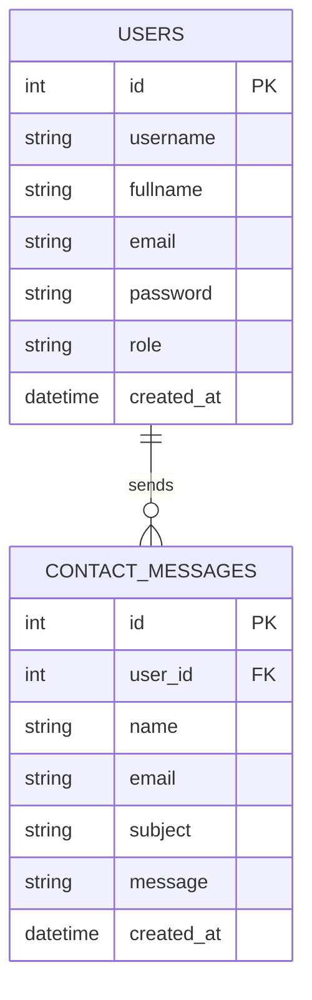

# ER Diagram

```mermaid
erDiagram
    USERS ||--o{ CONTACT_MESSAGES : sends

    USERS {
        int id PK
        string username
        string fullname
        string email
        string password
        string role
        datetime created_at
    }

    CONTACT_MESSAGES {
        int id PK
        int user_id FK
        string name
        string email
        string subject
        string message
        datetime created_at
    }
```
